# 🥖 Sistema Padaria

Sistema de gestão para padarias desenvolvido em Python, focado em controle de vendas, operação de caixa, impressão térmica e organização do atendimento.

## 🚀 Funcionalidades

- Registro de vendas
- Controle de caixa
- Histórico de vendas
- Dashboard administrativo
- Cadastro de produtos
- Pesquisa rápida de produtos
- Impressão térmica ESC/POS
- Abertura automática de gaveta
- Relatórios de vendas
- Operação por teclado
- Backup automático
- Sistema de licenciamento

## 🛠 Tecnologias

- Python
- SQLite
- PyInstaller
- ESC/POS
- Git
- GitHub

## 📷 Telas do Sistema

### Tela de Abertura

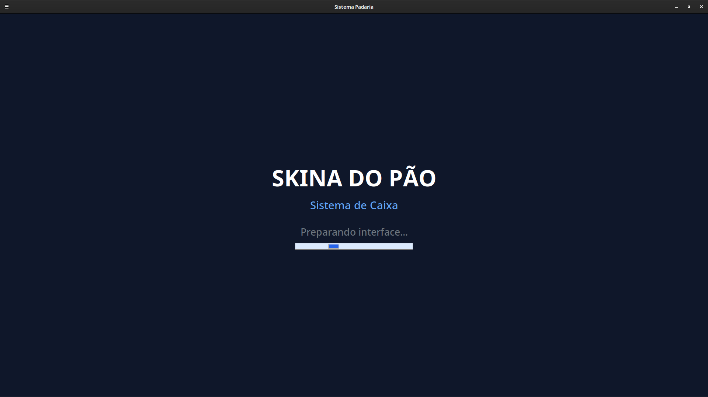

### Tela Inicial

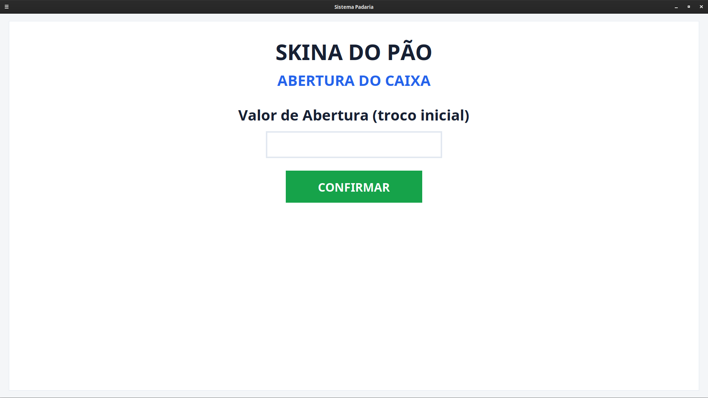

### Login Operador

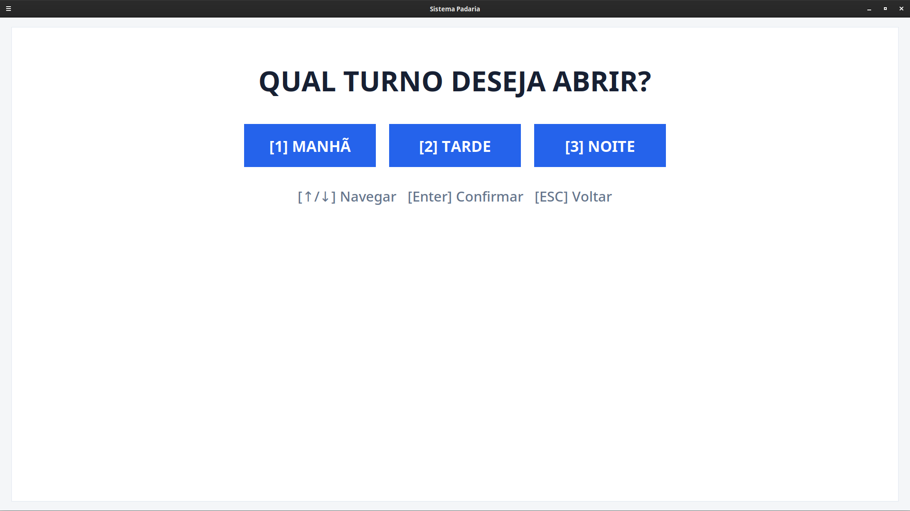

### Login Administrativo

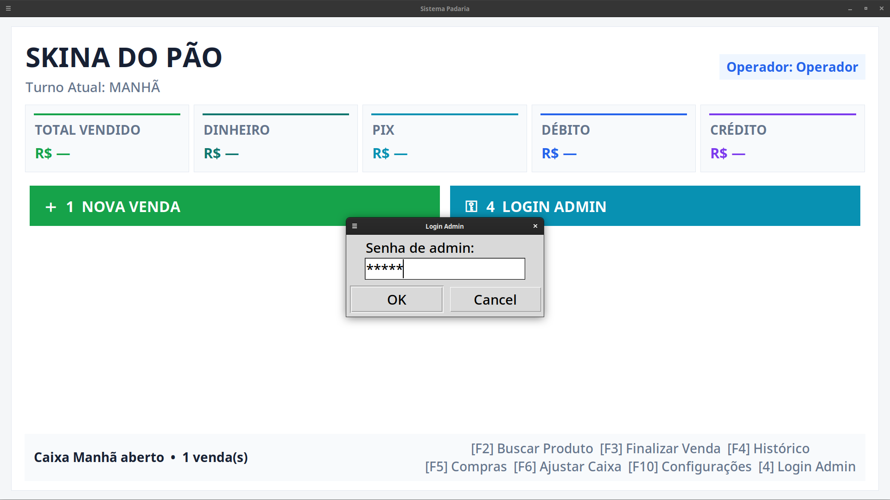

### Tela Principal de Vendas

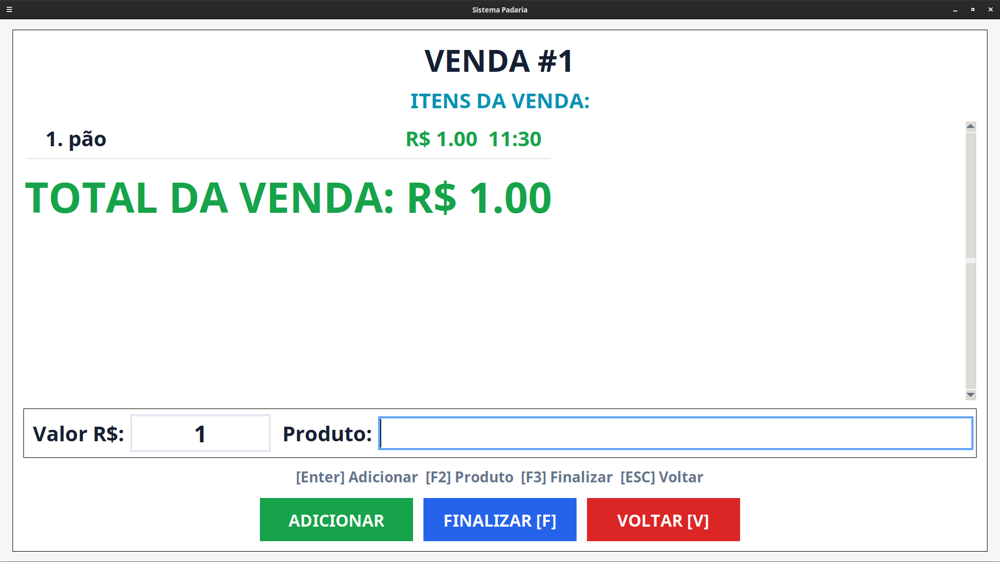

### Forma de Pagamento

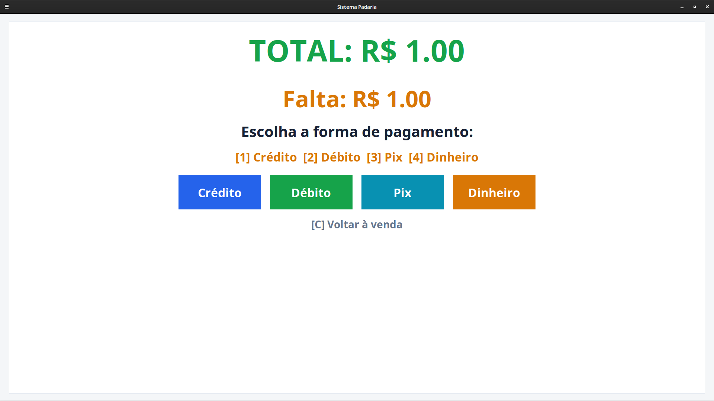

### Pagamento Concluído

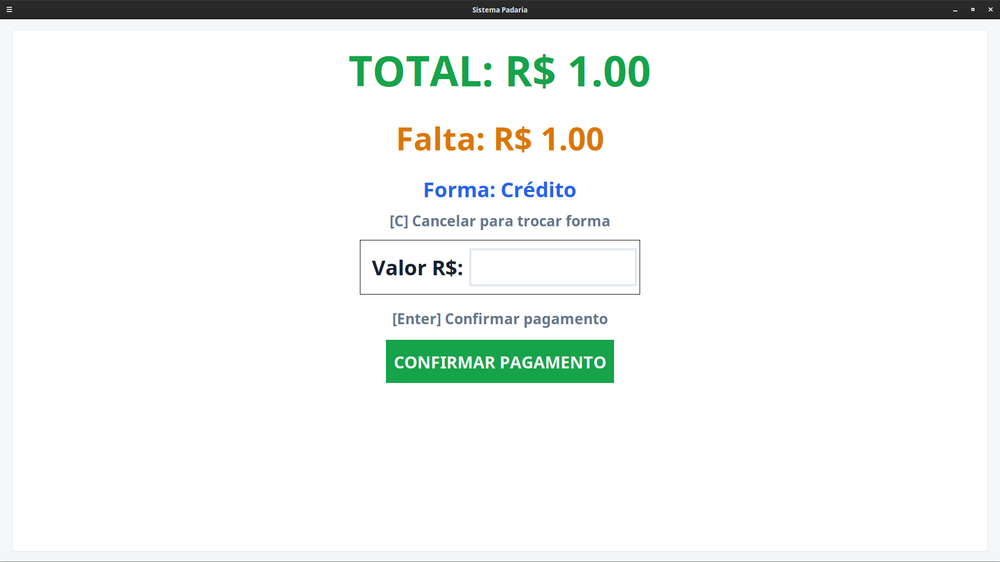

### Venda Concluída

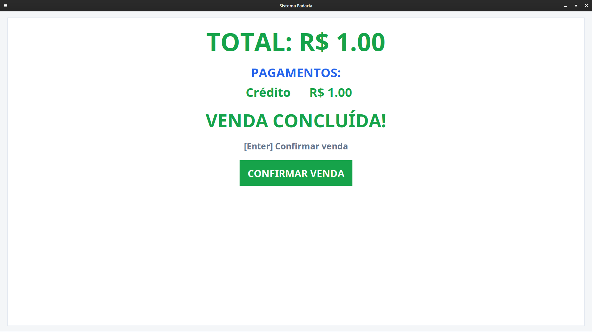

### Venda Finalizada

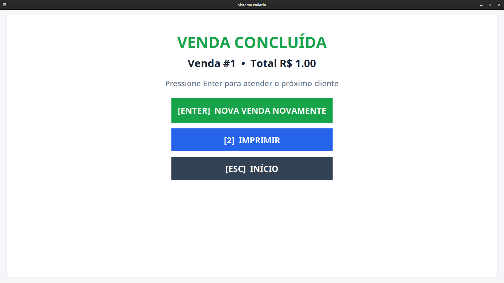

### Histórico de Vendas

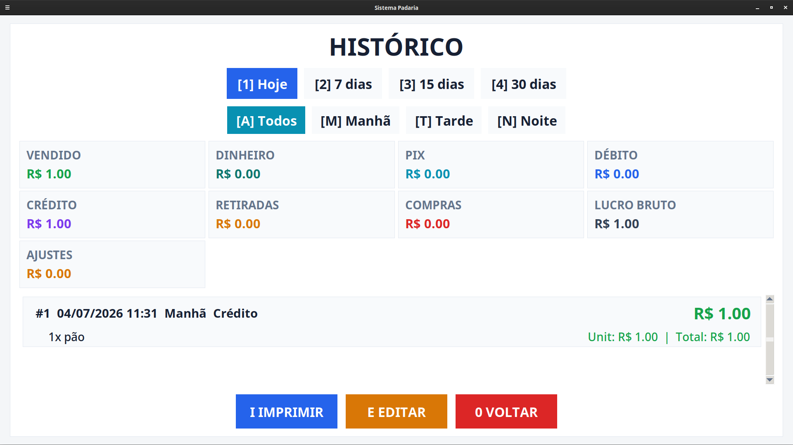

### Painel Administrativo

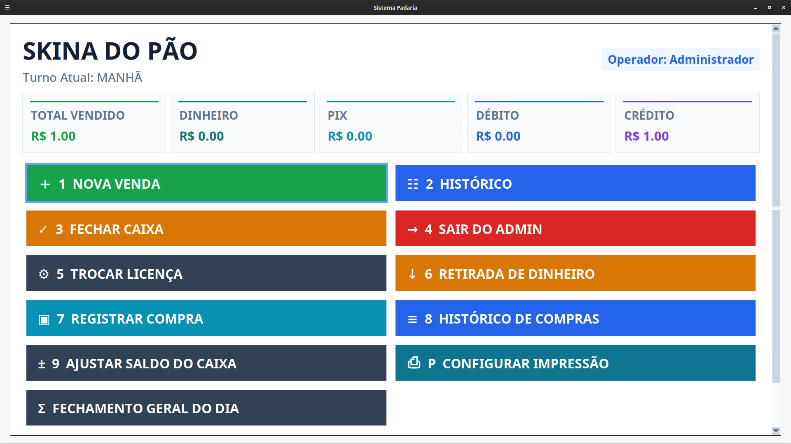

### Tela Inicial do Sistema

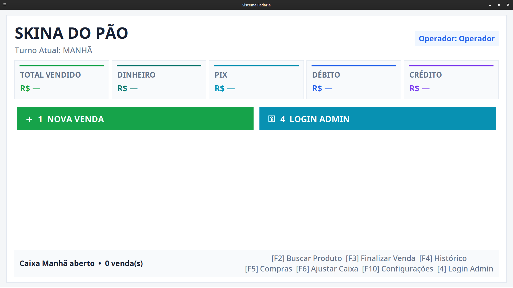

## 💡 Objetivo

Este projeto foi desenvolvido para atender padarias e pequenos comércios, oferecendo uma solução simples e eficiente para registro de vendas, controle de caixa e impressão de cupons.

## 👨‍💻 Autor

Samuel Barbosa da Silva

SBS Tech
